# catan-monte-carlo

Compare similiations of RNG and Card stack: dice mode from Catan Universe.

## Usage

Build the docker image.

```bash
make build
```

Get a development shell in the container.

```bash
make dev
```

Run the docker container.

```bash
make run
```

## Results

| Number Of Rolls | RNG Mode                                  | Dice Mode                                 |
|-----------------|-------------------------------------------|-------------------------------------------|
| 25              | 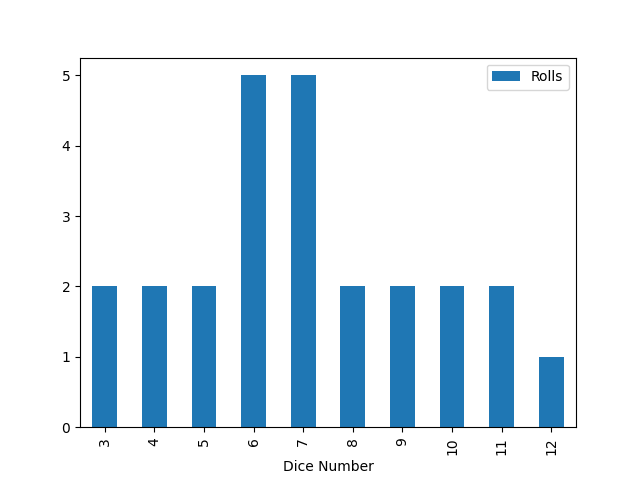        |        |
| 50              | 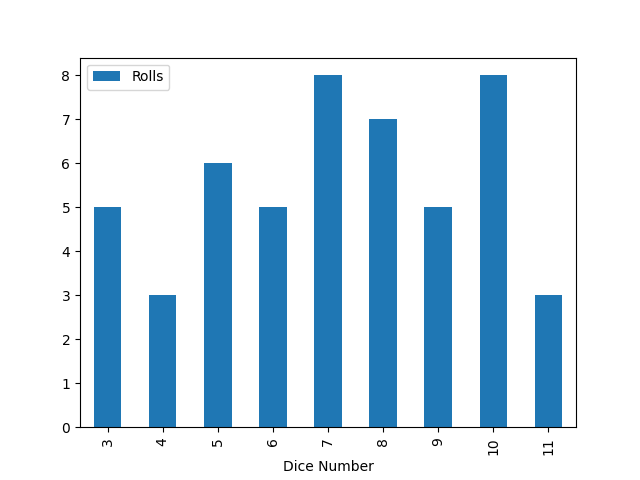        | 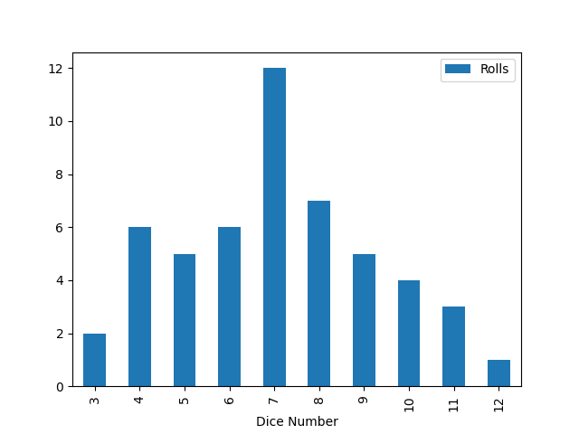       |
| 75              | 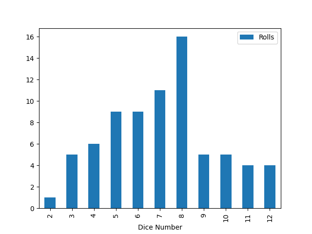        | 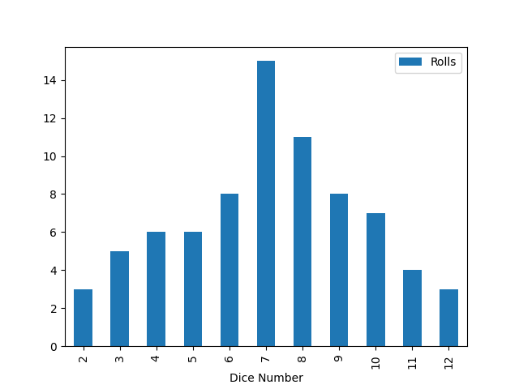       |
| 100             |       | 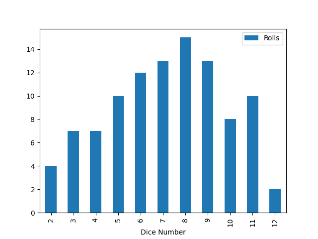     |
| 1000            | 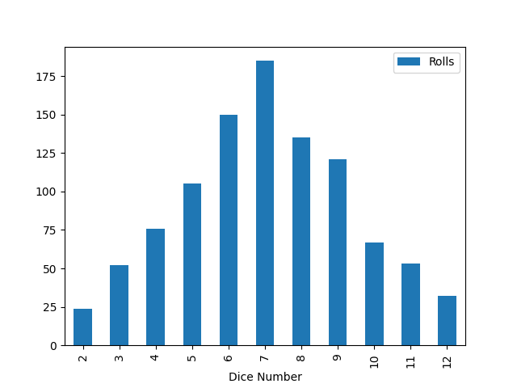    | 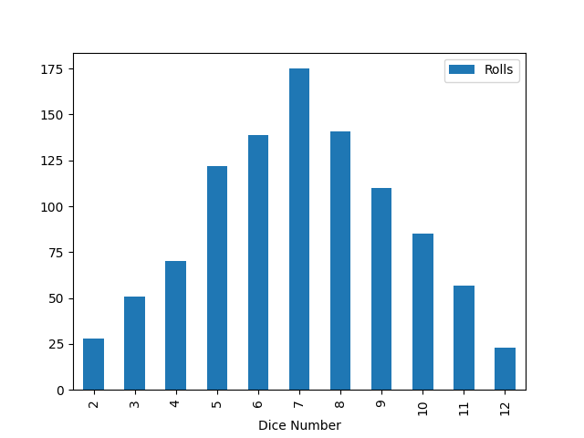   |
| 5000            |     | 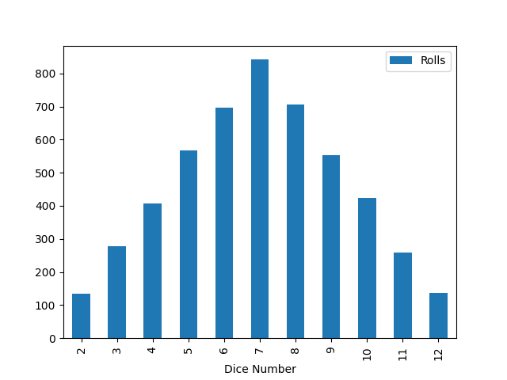   |
| 10000           | 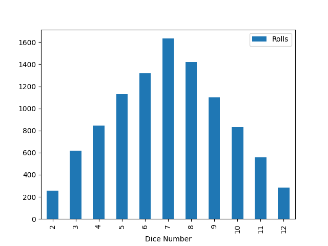  | 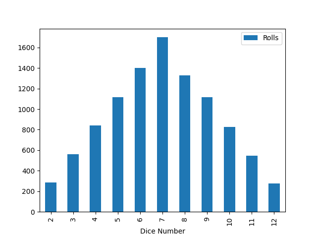 |